<style type="text/css">
h1.title {
  font-size: 60px;
  color: Navy;
  text-align: center;
  font-weight: bold;
}
h4.author { 
  font-size: 18px;
  #font-family: "Times New Roman", Times, serif;
  color: Black;
  text-align: left;
  font-weight: bold;
}
h4.date { 
  font-size: 18px;
  #font-family: "Times New Roman", Times, serif;
  color: Black;
  text-align: left;
  font-weight: bold;
}
</style>

```{r setup, include=FALSE}
knitr::opts_chunk$set(echo = TRUE)
```
<br><br>

# <span style="color: purple;"> 1)  Load data & Useful functions </span>


As first thing, here are reported the used external libraries to accomplish the task.  
```{r include=TRUE, message=FALSE, eval=TRUE, class.source="bg-success", warning=FALSE}
set.seed(42)
library(igraph)
library(tensorr)
```


Next, the data have been imported and 2 new directories ("images_asd","images_td") have been created to store the graph images that will be generated during the code execution.
```{r include=TRUE, message=FALSE, eval=FALSE, class.source="bg-success", warning=FALSE}

load("../Connect-your-Brain/data/hw3_data.RData") # import data
dir.create("images_asd", showWarnings = TRUE)
dir.create("images_td", showWarnings = TRUE)

```
 
Successively, are reported below, some useful function used during the analysis, in particular:

* zfisher = compute Z-Fisher Transformation

* CI_function = compute either Bonferreni or not CI and returns 0 if t is inside the CI otherwise 1.

* find_edges = takes in input 4 parameters:
  * matrix = correlation matrix,
  * N = number of row of the matrix,
  * t = threshold,
  * Bonferroni = boolean value for computing CI using Bonferroni correction or not.
<br><br>

* f_plot = it is the fuction used to plot and save the graphs. I takes in input 3 parameters:
  * g = the graph,
  * name = if a name is given, it saves a .png file for the graph, 
  * width_edges = parameter used to manually change the edge width.
<br><br>

* get_graphs = the function takes in input a list of correlation matrices a threshold (t) and a boolean parameter to decide if computing the CI with Bonferroni correction or not; it returns a list of adjacency matrices. This function is used when we want to obtain a graph for each person belonging either "Autism Spectrum Disorder (asd)" group or "Typically Developed (td)" group. This function, combined with the f_plot has been used to return images of the singular graphs associated to each person. 

* get_aggregate_graph <- the function takes in input a list of correlation matrices, a threshold (t) value and a boolean value to decide if compute the CI using Bonferroni correction or not. The function return a normalized weighted adjacency matrix. 

```{r include=TRUE, message=FALSE, eval=FALSE, class.source="bg-success", warning=FALSE}

zfisher <- function(x) 1/2*log((1+x)/(1-x)) # Z-Fisher Transform function

CI_function <- function(N,rho,alpha,t,bonferroni=TRUE){
  se = 1/sqrt(N-3) # standard error
  
  if (bonferroni){ # compute CI using Bonferroni correction
    lower = rho - qnorm(1-(alpha/2)/choose(116,2))*se 
    upper = rho + qnorm(1-(alpha/2)/choose(116,2))*se
  }  
  else{ # compute CI wihout Bonferroni correction
    lower = rho - qnorm(1-(alpha/2))*se
    upper = rho + qnorm(1-(alpha/2))*se
  } # check if an edge has to be added or not
  if (-t>= upper | t<= lower) return(1) 
  else return(0)
}

find_edges <- function(matrix,N,t,bonferroni=TRUE){
  for (i in 1:nrow(matrix)){
    for (j in 1:ncol(matrix)){
      # compute CI and check for edging iff we are not dealing with the 
      # diagonal matrix
      if (i != j) matrix[i,j] = CI_function(N, matrix[i,j], 0.05,t,bonferroni)
      else matrix[i,j] = 0 # add zero if diagonal matrix
    }
  }
  return(matrix)
}

f_plot<- function(g,name=NA,width_edges=NA){
  # the function is used to plot the graphs and, if a name is given, saves it
  if (is.na(width_edges)) width_edges=(0.1+E(g)$weight)^1.5*8
  
  if (!is.na(name)){
    png(filename=name, width = 10000, height = 4720) # open image
    plot(g, vertex.size = 1, edge.size = 0.001,
         edge.width= width_edges,
         vertex.frame.color=NA, vertex.color ='red',
         edge.color='black', layout=layouts)
    dev.off() # close and save image
  }
  
  else {
    plot(g, vertex.size = 1, edge.size = 0.001,
         edge.width= width_edges,
         vertex.frame.color=NA, vertex.color ='red',
         edge.color='black', layout=layouts)
  }
}

get_graphs <- function(list_df,t,bonferroni=TRUE){
  # the function takes in input a list of correlation matrices and returns
  # a list of graphs
  graph_list <- list() # list where store the graphs
  n = 1
  for (df in list_df){
    df_zfisher <- zfisher(df) # compute z fisher on all correlations
    edges <- find_edges(df_zfisher,nrow(df_zfisher),t,bonferroni) # get adjacency matrix
    # use the adjacency matrix to get the graph
    graph_get <- graph_from_adjacency_matrix(edges, mode = c("undirected") ) 
    graph_list[[n]] <- graph_get
    n = n+1
  }
  return(graph_list)
}

get_aggregate_graph <- function(list_df,t,bonferroni=TRUE){
  # the function takes in input a list of matrices and returns an adjacency matrix
  graph_matrix_list <- list() # list where store all 12 adjacency matrix
  n = 1
  for (df in list_df){
    df_zfisher <- zfisher(df) # apply z-fisher on each corr matrix
    edges <- find_edges(df_zfisher,nrow(df_zfisher),t,bonferroni)
    graph_matrix_list[[n]] <- edges # store adjacency matricews inside the list 
    n = n+1
  }
  # return a normalized weighted graph 
  graph_matrix <- Reduce('+', graph_matrix_list)/length(graph_matrix_list)
  return(graph_matrix)
}

```


# <span style="color: purple;"> 2)  Correlation </span>

In order to build up graphs representing interconnection among different areas of the brain for the population goups (asd and td) it has been decided to follow to different paths:

* first one = we assume that there are only two distributions coming from two different populations (one belonging to asd and another to td), so we will deal with 2 matrices each with 1740x116 as dimension. i.e we assume independence both in time and between people.

* second one = here instead we'll assume independence only in time, and we will treat separately each person and we'll aggregate the data only at the end by returning weighted graphs.

As can be understood by the previous statements, the 80% threshold t, can be obtained in two different ways depending on the approach.

## <span style="color: purple;"> 2.1)  Approach 1 </span>

As explained above, here we make two strong assumptions: independence in time and among people.

In the code below, in asd_bind & td_bind we aggregate all the the data and then we compute the correlation among each region of the brain (116 regions). Then we aggregate the two obtained correlation matrices to compute the desired 80% threshold. 
```{r include=TRUE, message=FALSE, eval=FALSE, class.source="bg-success", warning=FALSE}

asd_bind = do.call(rbind, asd_sel) # aggregate asd data
td_bind = do.call(rbind, td_sel) # aggregate td data

asd_bind_cor = cor(asd_bind) # compute asd cor
td_bind_cor = cor(td_bind) # compute td cor

asd_td_bind_matrix = rbind(asd_bind_cor, td_bind_cor) # aggregate asd & td cor

# get 80% percentile from the previously obtained matrix
t_bind <- quantile(abs(asd_td_bind_matrix), probs = c(0.8)) # get threshold
t_bind_zfisher = zfisher(t_bind) # apply zfisher on threshold
```


### <span style="color: purple;"> 2.1.1)  ASD Graph Connections </span>

```{r include=TRUE, message=FALSE, eval=FALSE, class.source="bg-success", warning=FALSE}

asd_bind_matrix_zfisher_cor = zfisher(asd_bind_cor) # apply zfisher on asd
asd_bind_matrix_zfisher <- find_edges(asd_bind_matrix_zfisher_cor, 145*12, t_bind_zfisher )
graph_asd <- graph_from_adjacency_matrix(asd_bind_matrix_zfisher, mode = c("undirected") )

layouts <- layout.davidson.harel(graph_asd) # get general layout. It is necessary in order to make comparisons
f_plot(graph_asd,name='images_asd/asd_1.png',width_edges = 1)
```
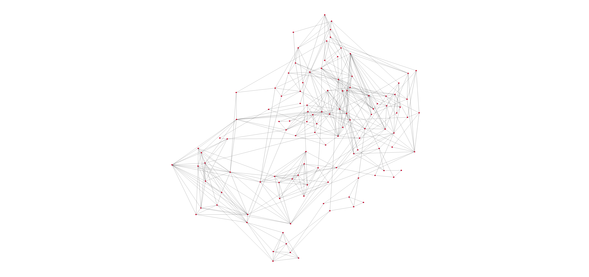

### <span style="color: purple;"> 2.1.2)  TD Graph Connections </span>

```{r include=TRUE, message=FALSE, eval=FALSE, class.source="bg-success", warning=FALSE}
td_bind_matrix_zfisher_cor = zfisher(td_bind_cor) # apply zfisher on td
td_bind_matrix_zfisher <- find_edges(td_bind_matrix_zfisher_cor, 145*12, t_bind_zfisher)
graph_td <- graph_from_adjacency_matrix(td_bind_matrix_zfisher, mode = c("undirected") )

f_plot(graph_td,name='images_td/td_1.png',width_edges = 1)
```


## <span style="color: purple;"> 2.2)  Approach 2 </span>

As explained at the beginning of section 2, now we'll show what happens if we assume independence only in time and so treating each person singularly.

In the code reported below, in asd_cor & td_cor we compute the Pearon correaltion coefficient for each person beloning to each group. Then we aggregate the data and we store them into the asd_matrix & td_matrix and, at the end, we use those two matrices to compute the new 80% threshold. 
```{r include=TRUE, message=FALSE, eval=FALSE, class.source="bg-success", warning=FALSE}

asd_cor = lapply(asd_sel, cor) # list of correlation matrices
td_cor = lapply(td_sel, cor) # list of correlation matrices

asd_matrix = do.call(rbind, asd_cor) # combine correlation matrices into 1 matrix
td_matrix = do.call(rbind, td_cor)  # combine correaltion matrices into 1 matrix

# combine preiovusly obtained correlation matrices into 1 big corr-matrix
asd_td_matrix = rbind(asd_matrix, td_matrix) 

# get 80% percentile from the previously obtained matrix
t <- quantile(abs(asd_td_matrix), probs = c(0.8)) 
t_zfisher = zfisher(t)
```


### <span style="color: purple;"> 2.2.1)  ASD Graph Connections </span>


```{r include=TRUE, message=FALSE, eval=FALSE, class.source="bg-success", warning=FALSE}
graph_asd_list <- get_graphs(asd_cor, t_zfisher) #graph per each asd person

# iterate through each graph to store them into .png files
m=1
for (g in graph_asd_list){
  f_plot(g,name=paste("images_asd/asd_2_person_",m,".png",sep=""),width_edges = 1)
  m=m+1 
}

```

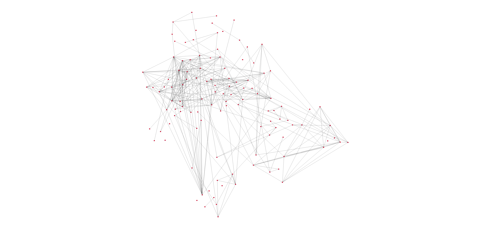 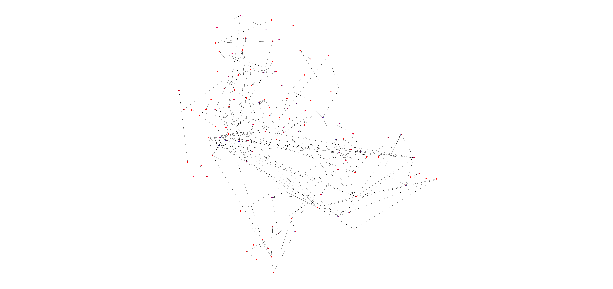 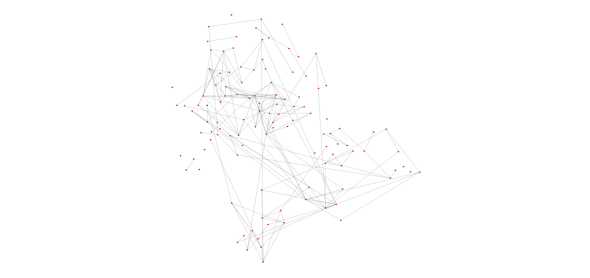 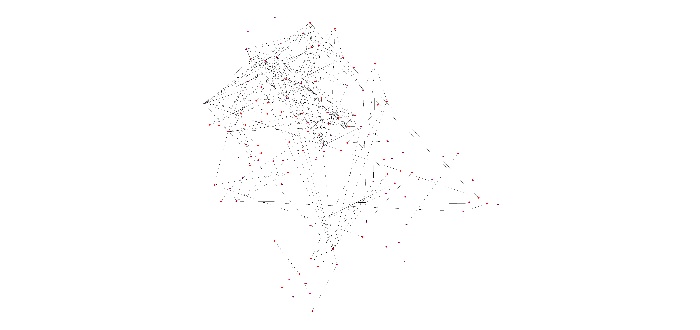
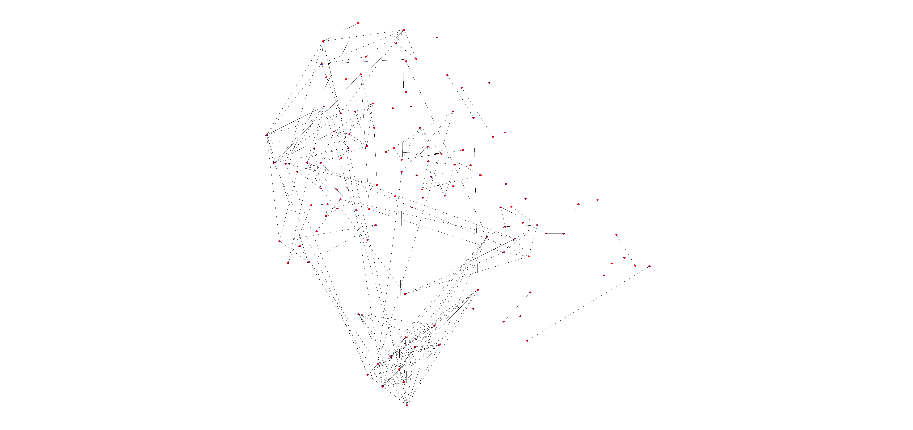 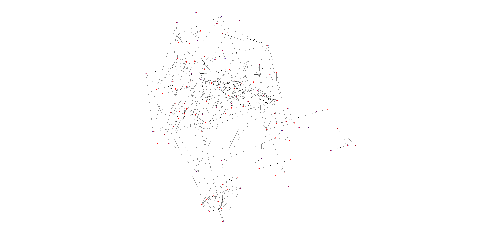


```{r include=TRUE, message=FALSE, eval=FALSE, class.source="bg-success", warning=FALSE}
# get weighted graph by aggregating the 12 people graphs 
edges_asd_2 <- get_aggregate_graph(asd_cor, t_zfisher) 
graph_asd_2 <- graph_from_adjacency_matrix(edges_asd_2,
                                           mode = c("undirected"),
                                           weighted = TRUE)

f_plot(graph_asd_2,name='images_asd/asd_2.png')
```
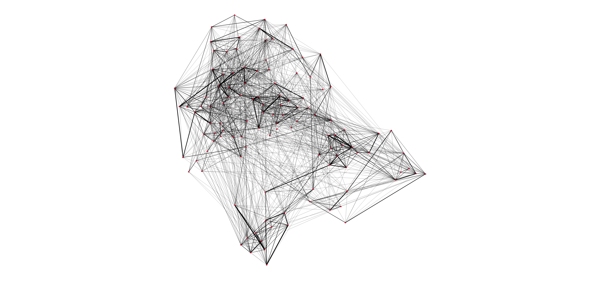

### <span style="color: purple;"> 2.2.2)  TD Graph Connections </span>


```{r include=TRUE, message=FALSE, eval=FALSE, class.source="bg-success", warning=FALSE}

graph_td_list <- get_graphs(td_cor, t_zfisher) #graph per each td person

m=1
for (g in graph_td_list){
  f_plot(g,name=paste("images_td/td_2_person_",m,".png",sep=""),width_edges = 1)
  m=m+1 
}

```

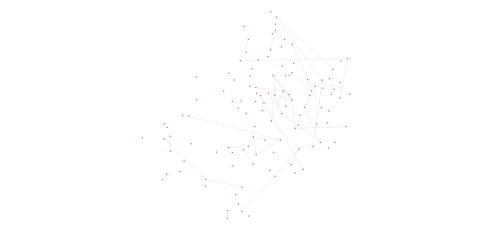  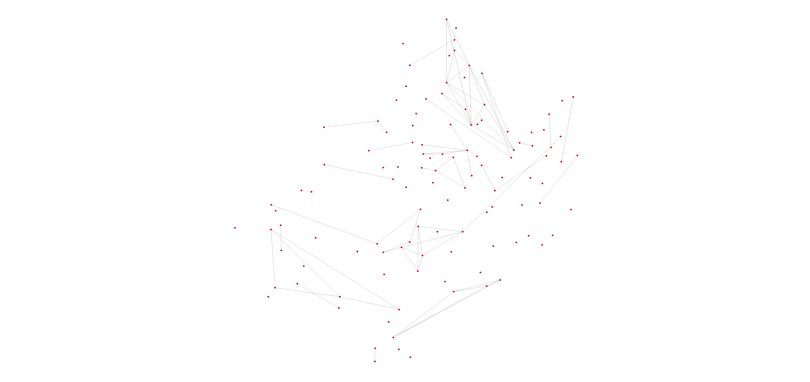 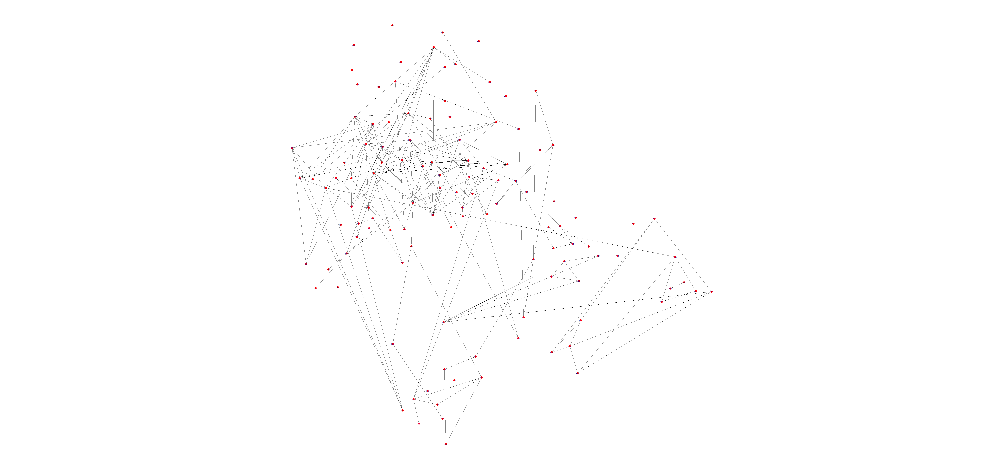
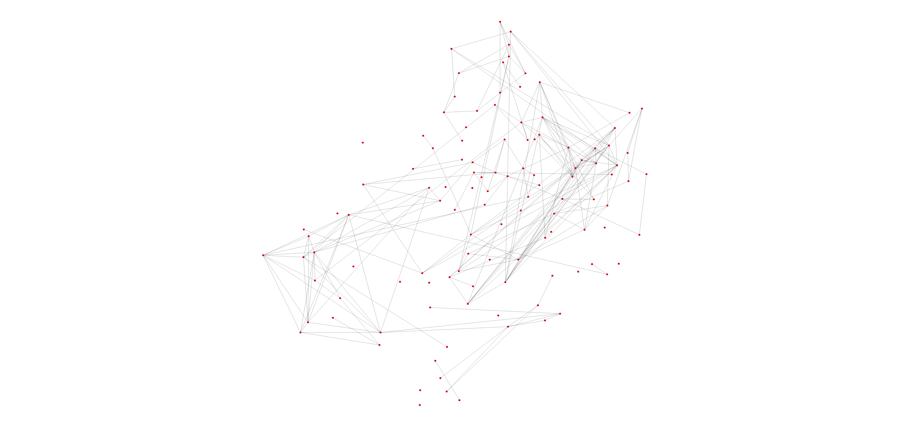 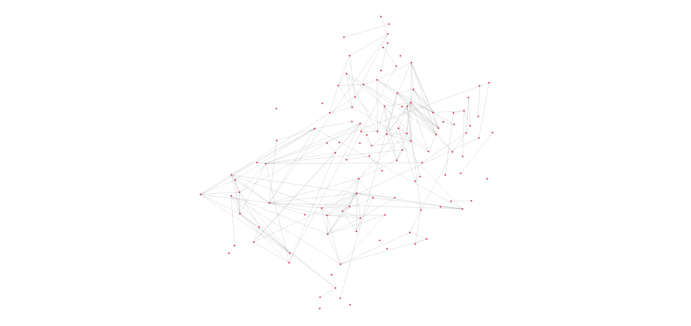

```{r include=TRUE, message=FALSE, eval=FALSE, class.source="bg-success", warning=FALSE}
# get weighted graph by aggregating the 12 people graphs
edges_td_2 <- get_aggregate_graph(td_cor, t_zfisher)
graph_td_2 <- graph_from_adjacency_matrix(edges_td_2,
                                           mode = c("undirected"),
                                           weighted = TRUE)

f_plot(graph_td_2,name='images_td/td_2.png')
```
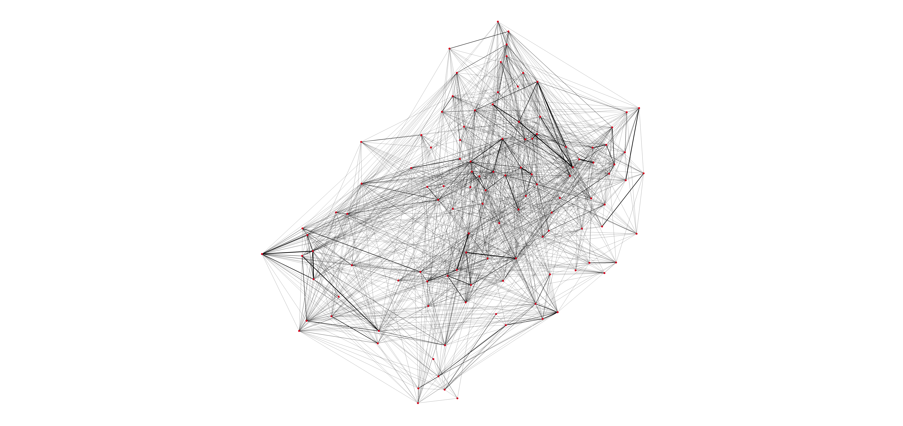


# <span style="color: purple;"> 3)  Correlation without Bonferroni </span>


# <span style="color: purple;"> 4)  BONUS </span>


