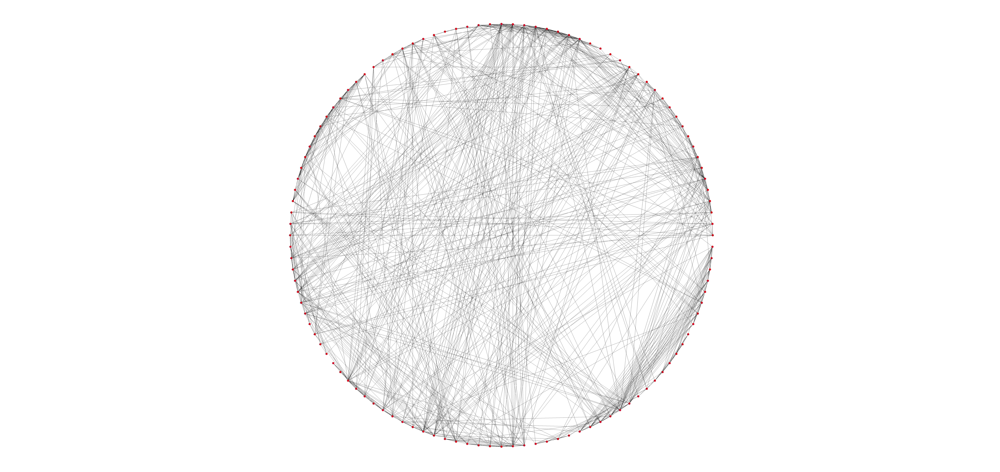
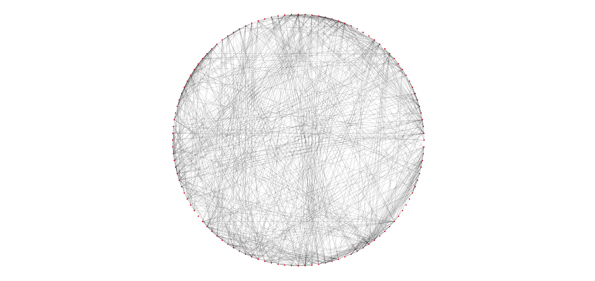
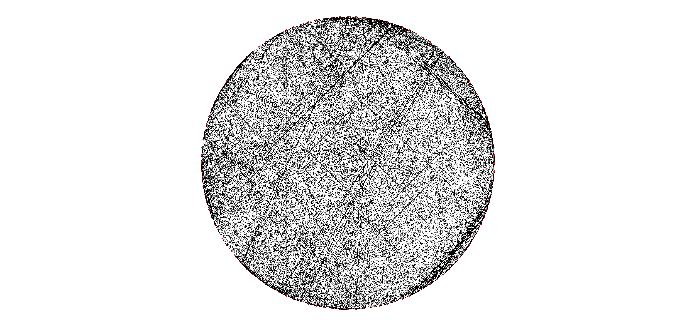
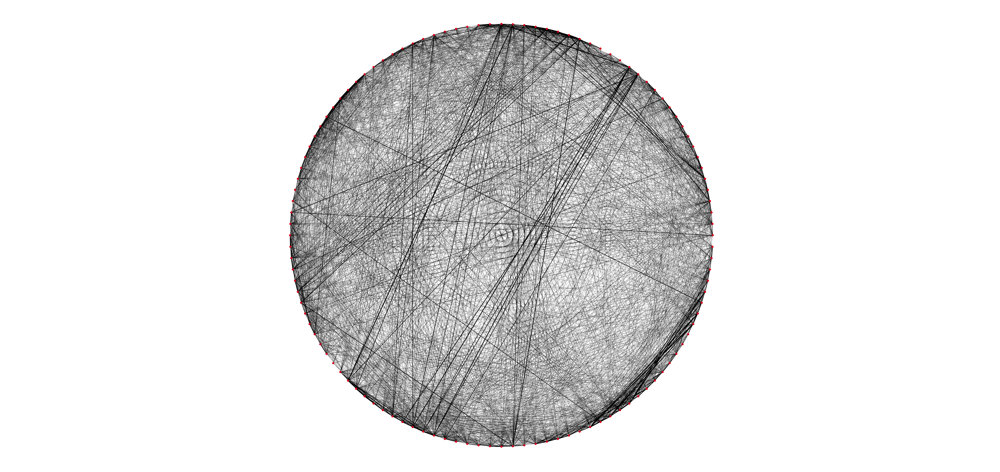
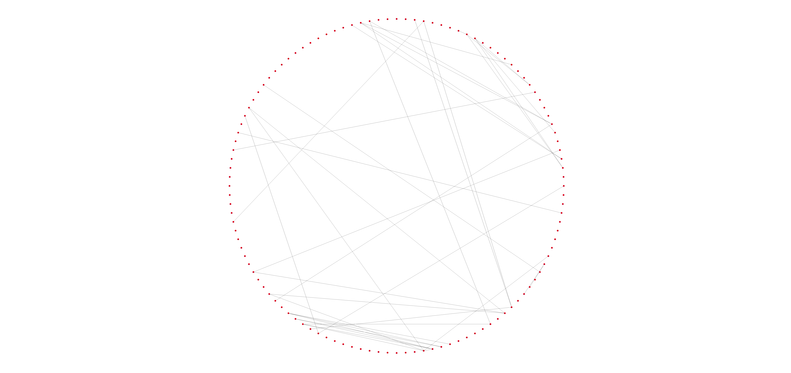

<style type="text/css">
h1.title {
  font-size: 60px;
  color: Navy;
  text-align: center;
  font-weight: bold;
}
h4.author { 
  font-size: 18px;
  #font-family: "Times New Roman", Times, serif;
  color: Black;
  text-align: left;
  font-weight: bold;
}
h4.date { 
  font-size: 18px;
  #font-family: "Times New Roman", Times, serif;
  color: Black;
  text-align: left;
  font-weight: bold;
}
</style>

```{r setup, include=FALSE}
knitr::opts_chunk$set(echo = TRUE)
```
<br><br>

## <span style="color: purple;"> 1)  Load data & Useful functions </span>


As first thing, here are reported the used external libraries to accomplish the task.  
```{r include=TRUE, message=FALSE, eval=TRUE, class.source="bg-success", warning=FALSE}
set.seed(42)
library(igraph)
library(tensorr)
library(cowplot)
library(ggplot2)
```


Next, the data have been imported and 6 new directories:

*"images_asd","images_asd/Bonferroni","images_asd/no_Bonferroni"

*"images_td","images_td/Bonferroni","images_td/no_Bonferroni" 
have been created to store the graph images that will be generated during the code execution.
```{r include=TRUE, message=FALSE, eval=FALSE, class.source="bg-success", warning=FALSE}

load("../Connect-your-Brain/data/hw3_data.RData") # import data
dir.create("images_asd", showWarnings = TRUE)
dir.create("images_asd/no_Bonferroni", showWarnings = TRUE)
dir.create("images_asd/Bonferroni", showWarnings = TRUE)
dir.create("images_td", showWarnings = TRUE)
dir.create("images_td/no_Bonferroni", showWarnings = TRUE)
dir.create("images_td/Bonferroni", showWarnings = TRUE)
```
 
Successively, are reported below, some useful function used during the analysis, in particular:

* __zfisher__ = compute Z-Fisher Transformation

* __CI_function__ = compute either Bonferreni or not CI and returns 0 if t is inside the CI otherwise 1.

* __find_edges__ = takes in input 4 parameters:
  * matrix = correlation matrix,
  * N = number of row of the matrix,
  * t = threshold,
  * Bonferroni = boolean value for computing CI using Bonferroni correction or not.
<br><br>

* __f_plot__ = it is the fuNction used to plot and save the graphs. I takes in input 3 parameters:
  * g = the graph,
  * name = if a name is given, it saves a .png file for the graph, 
  * width_edges = parameter used to manually change the edge width.
<br><br>

* __get_graphs__ = the function takes in input a list of correlation matrices a threshold (t) and a boolean parameter to decide if computing the CI with Bonferroni correction or not; it returns a list of adjacency matrices. This function is used when we want to obtain a graph for each person belonging either "Autism Spectrum Disorder (ASD)" group or "Typically Developed (TD)" group. This function, combined with the f_plot has been used to return images of the singular graphs associated to each person. 

* __get_aggregate_graph__ <- the function takes in input a list of correlation matrices, a threshold (t) value and a boolean value to decide if compute the CI using Bonferroni correction or not. The function return a normalized weighted adjacency matrix. 

```{r include=TRUE, message=FALSE, eval=FALSE, class.source="bg-success", warning=FALSE}

zfisher <- function(x) 1/2*log((1+x)/(1-x)) # Z-Fisher Transform function

CI_function <- function(N,rho,alpha,t,bonferroni=TRUE){
  se = 1/sqrt(N-3) # standard error
  
  if (bonferroni){ # compute CI using Bonferroni correction
    lower = rho - qnorm(1-(alpha/2)/choose(116,2))*se 
    upper = rho + qnorm(1-(alpha/2)/choose(116,2))*se
  }  
  else{ # compute CI wihout Bonferroni correction
    lower = rho - qnorm(1-(alpha/2))*se
    upper = rho + qnorm(1-(alpha/2))*se
  } # check if an edge has to be added or not
  if (-t>= upper | t<= lower) return(1) 
  else return(0)
}

find_edges <- function(matrix,N,t,bonferroni=TRUE){
  for (i in 1:nrow(matrix)){
    for (j in 1:ncol(matrix)){
      # compute CI and check for edging iff we are not dealing with the 
      # diagonal matrix
      if (i != j) matrix[i,j] = CI_function(N, matrix[i,j], 0.05,t,bonferroni)
      else matrix[i,j] = 0 # add zero if diagonal matrix
    }
  }
  return(matrix)
}

f_plot<- function(g,name=NA,width_edges=NA){
  # the function is used to plot the graphs and, if a name is given, saves it
  if (is.na(width_edges)) width_edges=(0.1+E(g)$weight)^1.5*8
  
  if (!is.na(name)){
    png(filename=name, width = 10000, height = 4720) # open image
    plot(g, vertex.size = 1, edge.size = 0.001,
         edge.width= width_edges,
         vertex.frame.color=NA, vertex.color ='red',
         edge.color='black', layout=layouts)
    dev.off() # close and save image
  }
  
  else {
    plot(g, vertex.size = 1, edge.size = 0.001,
         edge.width= width_edges,
         vertex.frame.color=NA, vertex.color ='red',
         edge.color='black', layout=layouts)
  }
}

get_graphs <- function(list_df,t,bonferroni=TRUE){
  # the function takes in input a list of correlation matrices and returns
  # a list of graphs
  graph_list <- list() # list where store the graphs
  n = 1
  for (df in list_df){
    df_zfisher <- zfisher(df) # compute z fisher on all correlations
    edges <- find_edges(df_zfisher,nrow(df_zfisher),t,bonferroni) # get adjacency matrix
    # use the adjacency matrix to get the graph
    graph_get <- graph_from_adjacency_matrix(edges, mode = c("undirected") ) 
    graph_list[[n]] <- graph_get
    n = n+1
  }
  return(graph_list)
}

get_aggregate_graph <- function(list_df,t,bonferroni=TRUE){
  # the function takes in input a list of matrices and returns an adjacency matrix
  graph_matrix_list <- list() # list where store all 12 adjacency matrix
  n = 1
  for (df in list_df){
    df_zfisher <- zfisher(df) # apply z-fisher on each corr matrix
    edges <- find_edges(df_zfisher,nrow(df_zfisher),t,bonferroni)
    graph_matrix_list[[n]] <- edges # store adjacency matricews inside the list 
    n = n+1
  }
  # return a normalized weighted graph 
  graph_matrix <- Reduce('+', graph_matrix_list)/length(graph_matrix_list)
  return(graph_matrix)
}

```


## <span style="color: purple;"> 2)  Correlation </span>

In order to build up graphs representing interconnection among different areas of the brain for the population groups (ASD and TD) it has been decided to follow to different paths:

* __Approach 1__ = we assume that there are only two distributions coming from two different populations (one belonging to ASD and another to TD), so we will deal with 2 matrices each with 1740x116 as dimension. i.e we assume independence both in time and between people.

* __Approach 2__ = here instead we'll assume independence only in time, and we will treat separately each person and we'll aggregate the data only at the end by returning weighted graphs.

We decided to use different thresholds t in the two approaches since the underlying assumptions are different.

* __Threshold(t) In approach 1__:
  * We group the data for the 12 people with asd and the 12 td people into two matrices of dimension 1740x116.
  * We compute the correlation matrices and then combine them.
  * We set the threshold as the 80-th percentile value in the combined values.
* __Threshold(t) In approach 2__:
  * We first compute the correlation matrices for every different person.
  * We now combine all the matrices into a single one.
  * We set the threshold as the 80-th percentile value in the combined values.

### <span style="color: CornflowerBlue;"> 2.1)  Approach 1 </span> {#A1}

As explained above, here we make two strong assumptions: independence in time and among people.

In the code below, in asd_bind & td_bind we aggregate all the the data and then we compute the correlation among each region of the brain (116 regions). Then we aggregate the two obtained correlation matrices to compute the desired 80% threshold. 
```{r include=TRUE, message=FALSE, eval=FALSE, class.source="bg-success", warning=FALSE}

asd_bind = do.call(rbind, asd_sel) # aggregate asd data
td_bind = do.call(rbind, td_sel) # aggregate td data

asd_bind_cor = cor(asd_bind) # compute asd cor
td_bind_cor = cor(td_bind) # compute td cor

asd_td_bind_matrix = rbind(asd_bind_cor, td_bind_cor) # aggregate asd & td cor

# get 80% percentile from the previously obtained matrix
t_bind <- quantile(abs(asd_td_bind_matrix), probs = c(0.8)) # get threshold
t_bind_zfisher = zfisher(t_bind) # apply zfisher on threshold
```


#### <span style="color: CornflowerBlue;"> 2.1.1)  ASD Graph Connections </span>

Here, before finding the adjacency matrix, we perform the z-Fisher Transform on the whole correlation matrix and only then we pass it into the find_edges function to return the adjacency matrix.
```{r include=TRUE, message=FALSE, eval=FALSE, class.source="bg-success", warning=FALSE}

asd_bind_matrix_zfisher_cor = zfisher(asd_bind_cor) # apply zfisher on asd
asd_bind_matrix_zfisher <- find_edges(asd_bind_matrix_zfisher_cor, 145*12, t_bind_zfisher )
graph_asd <- graph_from_adjacency_matrix(asd_bind_matrix_zfisher, mode = c("undirected") )

layouts <- layout.davidson.harel(graph_asd) # get general layout. It is necessary in order to make comparisons
f_plot(graph_asd,name='images_asd/Bonferroni/asd_1.png',width_edges = 1)
```

Below is returned the $\widehat{G}^{ASD}(t)$ obtained by following Approach 1 and applying Bonferroni Correction.

 


#### <span style="color: CornflowerBlue;"> 2.1.2)  TD Graph Connections </span>

As performed of the ASD Graph, here we repeat the same steps but on the TD group.

```{r include=TRUE, message=FALSE, eval=FALSE, class.source="bg-success", warning=FALSE}
td_bind_matrix_zfisher_cor = zfisher(td_bind_cor) # apply zfisher on td
td_bind_matrix_zfisher <- find_edges(td_bind_matrix_zfisher_cor, 145*12, t_bind_zfisher)
graph_td <- graph_from_adjacency_matrix(td_bind_matrix_zfisher, mode = c("undirected") )

f_plot(graph_td,name='images_td/Bonferroni/td_1.png',width_edges = 1)
```

Below is returned the $\widehat{G}^{TD}(t)$ returned fallowing Approach 1 and applying Bonferroni Correction.


### <span style="color: CornflowerBlue;"> 2.2)  Approach 2 </span> {#A2}

As explained at the beginning of section 2, now we'll show what happens if we assume independence only in time and so treating each person singularly.

In the code reported below, in asd_cor & td_cor we compute the Pearson correlation coefficient for each person belonging to each group. Then we aggregate the data and we store them into the asd_matrix & td_matrix and, at the end, we use those two matrices to compute the new 80% threshold. 
```{r include=TRUE, message=FALSE, eval=FALSE, class.source="bg-success", warning=FALSE}

asd_cor = lapply(asd_sel, cor) # list of correlation matrices
td_cor = lapply(td_sel, cor) # list of correlation matrices

asd_matrix = do.call(rbind, asd_cor) # combine correlation matrices into 1 matrix
td_matrix = do.call(rbind, td_cor)  # combine correaltion matrices into 1 matrix

# combine preiovusly obtained correlation matrices into 1 big corr-matrix
asd_td_matrix = rbind(asd_matrix, td_matrix) 

# get 80% percentile from the previously obtained matrix
t <- quantile(abs(asd_td_matrix), probs = c(0.8)) 
t_zfisher = zfisher(t)
```


#### <span style="color: CornflowerBlue;"> 2.2.1)  ASD Graph Connections </span>

Here, since we are following the approach 2, we first compute graphs for each person and then we combine them to return the $\widehat{G}^{ASD}(t)$ as a weighted graph.
```{r include=TRUE, message=FALSE, eval=FALSE, class.source="bg-success", warning=FALSE}
graph_asd_list <- get_graphs(asd_cor, t_zfisher) #graph per each asd person

# iterate through each graph to store them into .png files
m=1
for (g in graph_asd_list){
  f_plot(g,name=paste("images_asd/Bonferroni/asd_2_person_",m,".png",sep=""),width_edges = 1)
  m=m+1 
}

```

Below are plotted the first 4 graphs, representing the first 4 people in the given dataset (asd people). Following the path "images_asd/Bonferroni/" is possibile to find out all the 12 images graphs refering to each person.

```{r include=FALSE, message=FALSE, eval=TRUE, class.source="bg-success", warning=FALSE}
p1 <- ggdraw() + draw_image("images_asd/asd_2_person_1.jpg", scale = 1)
p2 <- ggdraw() + draw_image("images_asd/asd_2_person_2.jpg", scale = 1)
p3 <- ggdraw() + draw_image("images_asd/asd_2_person_3.jpg", scale = 1)
p4 <- ggdraw() + draw_image("images_asd/asd_2_person_4.jpg", scale = 1)
```

```{r include=TRUE, message=FALSE, eval=TRUE, class.source="bg-success", warning=FALSE}
plot_grid(p1, p2)
```

__Figure 3: $\widehat{g}^{ASD}_1$(Person 1) & $\widehat{g}^{ASD}_2$(Person 2)__

```{r include=TRUE, message=FALSE, eval=TRUE, class.source="bg-success", warning=FALSE}
plot_grid(p3, p4)
```

__Figure 4: $\widehat{g}^{ASD}_3$(Person 3) & $\widehat{g}^{ASD}_4$(Person 4)__

Now that we have computed graphs per each person separately, we can combine them into one weighted graph. The code and the picture below show the obtained graph.
```{r include=TRUE, message=FALSE, eval=FALSE, class.source="bg-success", warning=FALSE}
# get weighted graph by aggregating the 12 people graphs 
edges_asd_2 <- get_aggregate_graph(asd_cor, t_zfisher) 
graph_asd_2 <- graph_from_adjacency_matrix(edges_asd_2,
                                           mode = c("undirected"),
                                           weighted = TRUE)

f_plot(graph_asd_2,name='images_asd/Bonferroni/asd_2.png')
```

Below is returned the $\widehat{G}^{ASD}(t)$, fallowing Approach 2, with Bonferroni Correction. 


#### <span style="color: CornflowerBlue;"> 2.2.2)  TD Graph Connections </span>

Here, since we are following the approach 2, we first compute graphs for each person and then we combine them to return the $\widehat{G}^{TD}(t)$  as a weighted graph.
```{r include=TRUE, message=FALSE, eval=FALSE, class.source="bg-success", warning=FALSE}

graph_td_list <- get_graphs(td_cor, t_zfisher) #graph per each td person

m=1
for (g in graph_td_list){
  f_plot(g,name=paste("images_td/Bonferroni/td_2_person_",m,".png",sep=""),width_edges = 1)
  m=m+1 
}

```

Below are plotted the first 4 graphs, representing the first 4 people in the given dataset (TD people). Following the path "images_td/Bonferroni/" is possible to find out all the 12 images graphs refering to each person.

```{r include=FALSE, message=FALSE, eval=TRUE, class.source="bg-success", warning=FALSE}
p1 <- ggdraw() + draw_image("images_td/td_2_person_1.jpg", scale = 1)
p2 <- ggdraw() + draw_image("images_td/td_2_person_2.jpg", scale = 1)
p3 <- ggdraw() + draw_image("images_td/td_2_person_3.jpg", scale = 1)
p4 <- ggdraw() + draw_image("images_td/td_2_person_4.jpg", scale = 1)
```


```{r include=TRUE, message=FALSE, eval=TRUE, class.source="bg-success", warning=FALSE}
plot_grid(p1, p2)
```

__Figure 6: $\widehat{g}^{TD}_1$(Person 1) & $\widehat{g}^{TD}_2$(Person 2)__

```{r include=TRUE, message=FALSE, eval=TRUE, class.source="bg-success", warning=FALSE}
plot_grid(p3, p4)
```

__Figure 7: $\widehat{g}^{TD}_3$(Person 3) & $\widehat{g}^{TD}_4$(Person 4)__

Now that we have computed graphs per each person separately, we can combine them into one weighted graph. The code and the picture below show the obtained graph.
```{r include=TRUE, message=FALSE, eval=FALSE, class.source="bg-success", warning=FALSE}
# get weighted graph by aggregating the 12 people graphs
edges_td_2 <- get_aggregate_graph(td_cor, t_zfisher)
graph_td_2 <- graph_from_adjacency_matrix(edges_td_2,
                                           mode = c("undirected"),
                                           weighted = TRUE)

f_plot(graph_td_2,name='images_td/Bonferroni/td_2.png')
```

Below is returned the $\widehat{G}^{TD}(t)$, fallowing Approach 2, with Bonferroni Correction. 


## <span style="color: purple;"> 3)  Correlation without Bonferroni </span>

In this section we repeat the same procedures described above ([Approach 1](#A1) and [Approach 2](#A2)) but working with unadjusted intervals (No Bonferroni corrections).

### <span style="color: CornflowerBlue;"> 3.1)  Approach 1 without Bonferroni </span>

Here below is reported the code used to compute the graphs for both ASD and TD people (following [Approach 1](#A1) ) without applying the Bonferroni correction.
```{r include=TRUE, message=FALSE, eval=FALSE, class.source="bg-success", warning=FALSE}

# NO Bonferroni on ASD people
asd_bind_matrix_zfisher_no_bonferroni <- find_edges(asd_bind_matrix_zfisher_cor, 145*12, t_bind_zfisher,bonferroni=FALSE ) # compute adjacency matrix

graph_asd_no_bonferroni <- graph_from_adjacency_matrix(asd_bind_matrix_zfisher_no_bonferroni, mode = c("undirected") ) # get graph

f_plot(graph_asd_no_bonferroni,name='images_asd/no_Bonferroni/asd_1_no_bonferroni.png',width_edges = 1) # save image into folder

# NO Bonferroni on TD people
td_bind_matrix_zfisher_no_bonferroni <- find_edges(td_bind_matrix_zfisher_cor, 145*12, t_bind_zfisher,bonferroni = FALSE) # compute adjacency matrix

graph_td_no_bonferroni <- graph_from_adjacency_matrix(td_bind_matrix_zfisher_no_bonferroni, mode = c("undirected") ) # get graph

f_plot(graph_td_no_bonferroni,name='images_td/no_Bonferroni/td_1_no_bonferroni.png',width_edges = 1) # save image into folder

```

Here is it possible to see the new graphs generated __without__ the Bonferroni correction.





### <span style="color: CornflowerBlue;"> 3.2)  Approach 2 without Bonferroni </span>

Here below is reported the code used to compute the graphs for both ASD and TD ( following the [Approach 2](#A2)) people without applying the Bonferroni correction.
```{r include=TRUE, message=FALSE, eval=FALSE, class.source="bg-success", warning=FALSE}

# Compute singular graphs per each person without Bonferroni correction

#(1) asd people

## (1.1) asd graph per person
graph_asd_list_no_bonferroni <- get_graphs(asd_cor, t_zfisher, bonferroni = FALSE) #graph per each asd person
m=1
for (g in graph_asd_list_no_bonferroni){
  f_plot(g,name=paste("images_asd/no_Bonferroni/asd_2_person_",m,"_no_bonferroni.png",sep=""),width_edges = 1)
  m=m+1 
}

## (1.2) Combine asd graphs
edges_asd_2_no_bonferroni <- get_aggregate_graph(asd_cor, t_zfisher, bonferroni = FALSE)
graph_asd_2_no_bonferroni <- graph_from_adjacency_matrix(edges_asd_2_no_bonferroni,
                                           mode = c("undirected"),
                                           weighted = TRUE)

f_plot(graph_asd_2_no_bonferroni,name='images_asd/no_Bonferroni/asd_2_no_bonferroni.png')


# (2) td people

## (2.1) td graph per each person
graph_td_list_no_bonferroni <- get_graphs(td_cor, t_zfisher, bonferroni = FALSE) #graph per each td person

m=1
for (g in graph_td_list_no_bonferroni){
  f_plot(g,name=paste("images_td/no_Bonferroni/td_2_person_",m,"_no_bonferroni.png",sep=""),width_edges = 1)
  m=m+1 
}

## (2.2) Combine td graphs

edges_td_2_no_bonferroni <- get_aggregate_graph(td_cor, t_zfisher, bonferroni=FALSE)
graph_td_2_no_bonferroni <- graph_from_adjacency_matrix(edges_td_2_no_bonferroni,
                                          mode = c("undirected"),
                                          weighted = TRUE)

f_plot(graph_td_2_no_bonferroni,name='images_td/no_Bonferroni/td_2_no_bonferroni.png')

```

Here is it possible to see the new graphs generated __without__ the Bonferroni correction.





## <span style="color: purple;"> 4)  RESULTS </span>

Fallowing [Approach 1](#A1) one gets slightly more connections among ROIs in td people (560 edges) compared to the people with asd (474 edges). It is interesting to notice that most of the connections are shared by both. In fact if we do the intersection among the two graphs (\textit{graph_asd %s% graph_td}) it is possible to find out that they share 358 edges.  

Instead, [Approach 1](#A2)  make possible to see that most of the thickest edges (i.e edges most common in each respective population) are present in both graphs. 

#####################
6002--6001
2301--2311
8102--3002
#######################

As a general note, we want to to point out that having some domain knowledge would help to draw some more robust conclusions. For example, knowing how the data have been collected, if there could be an intrinsic bias in the data collection procedure. Like for example if some ROI are more significant then others. 


Regarding the Bonferroni correction we want to point that, as expected, the number of "findings" without applying it, is significantly higher than compared to the graph generated with the multiplicity correction. The reason why using as a Null Hypothesis that rho is inside the interval [-t,t] is useful is that it reduces the number of edges in the graphs.

The Bonferroni correction and all the multiplicity corrections in general are not to get "less" data because it makes it easy to draw conclusions, but they're used to contrast the possibility of making erroneous inferences.
In this case in particular, if one "forgets" to apply the correction, not only one gets incorrect statistical inferences but the stronger connections (that we believe are the most significant) get lost since also too many edges with a weak correlation would be in the graph.


## <span style="color: purple;"> 5)  BONUS </span>

By looking at the data, we found out that they are very close to the normal distribution (as shown in Figure 13), so we have decided to compute Normal Confidence intervals:

\[CI_{normal} = \widehat{\rho_{n}} \pm z_{\frac{\alpha}{2}}*\widehat{se_{boot}} \] 


Below is reported the code used to plot Figure 13:
```{r include=TRUE, message=FALSE, eval=FALSE, class.source="bg-success", warning=FALSE}
png(filename='images_bootstrap/Difference_distribution.png', width = 1000, height = 600) # open image
par(mfrow = c(2, 3))
for (i in 100:105){
  if (i!=105){
  y <- array(boots_tensor_res[1,i+1,])
  hist(y, freq=FALSE, col = 'CornflowerBlue', ylim = c(0,max(density(y)$y)+1),
       main = bquote(paste('Distribution of ROI'[1],' and ROI',''[.(i+1)] )),
       font.main=4,
       xlab = 'Correlation Values',
       cex.lab=1.7,
       cex.axis=1.5,
       cex.main=2)
  curve(dnorm(x,mean=mean(y),sd=sd(y)), add=TRUE,col="red", lwd=3)
  lines(density(y),col='green', lwd=3, lty=3)
  }
  else{
    plot(NULL ,xaxt='n',yaxt='n',bty='n',ylab='',xlab='', xlim=0:1, ylim=0:1)
    legend("center", legend=c("Normal Distribution", "Actual Distribution"),
           col=c("red", "green"), lty=2:3, pt.cex=5, cex=2.5, bty='o')
  }
}
dev.off() # close and save image

```


We realized that, even if we use a threshold t=0, by using the normal confidence intervals we get few edges in the difference graph. Since after the Bonferroni correction, extreme values become relevant and tails of the distributions are not well approximated by the Gaussian, we also computed Percentile Confidence Itervals to compute the difference graph.

\[CI_{percentile} = quantile(data, \frac{\alpha}{2}, 1-\frac{\alpha}{2}) \] 

Regarding the threshold (t), since it is arbitrary and it is used to decide what is relevant and what not,  we have seen that setting t =0 still a small number of edges are identified. For that reason we have left it equals to zero. 

### <span style="color: CornflowerBlue;"> 5.1) Practical Bootstrap Implementation </span>

We used a $116*116*S$ tensor(where S is the bootstrap size set equal to 5000), 
where we stored S difference correlation matrices. The reason why we used a tensor tot store the bootstrap results is that this allowed us easy get all the values that the bootstrap produced for an entry of the correlation matrix.

The Non-Parametric bootstrap procedure involves a resampling method from the population (where the population is considered the in-our-hand-data) so, in every $s^{th}$ step, both for ASD and TD groups we picked at random 12 people __with__ replacement. Then, by following [Approach 1](#A1), we computed the Pearson-Correlation-Coefficient for both groups (ASD, TD) and after that the Difference-Correlation is computed ($|\Delta_{jk}| = |\rho_{jk}^{ASD} - \rho_{jk}^{TD}|$). 

```{r include=TRUE, message=FALSE, eval=FALSE, class.source="bg-success", warning=FALSE}
S <- 5000 # bootstrap size

difference_matrix <- asd_bind_cor - td_bind_cor  # point-estimate of diff. matrix
dims <- c(116,116,S) #tensor dimension
vals <- array(rep(0,116*116*S),dims) # pre
boots_tensor_res <- dtensor(vals) # tensor where we store bootstrap results

for (i in 1:S){
  
  pick_sample_asd <- sample(1:12, 12, replace=T) #pick a sample of 12 individuals from the asd population
  pick_sample_td <- sample(1:12, 12, replace=T) #pick a sample of 12 individuals from the td population
  
  #We'll now follow the first approach and put the all the data in two 1740x116 matrices.
  boots_asd <- do.call(rbind,asd_sel[pick_sample_asd])
  boots_td <- do.call(rbind,td_sel[pick_sample_td])
  
  #We calculate the correlation matrix for both the asd and the 
  boots_asd_cor <- cor(boots_asd)
  boots_td_cor <- cor(boots_td)
  boots_delta <- (boots_asd_cor - boots_td_cor)/2 
  boots_tensor_res[,,i] <- boots_delta #We store the computed matrix with all the difference as one slice of a tensor.
  if (i%%100 == 0) print(i)
}
```


Below the code used to compute the Normal and Percentile Confidence Intervals:

```{r include=TRUE, message=FALSE, eval=FALSE, class.source="bg-success", warning=FALSE}

#This function calculates the Percentile CI interval
percentile_CI <- function(datax, alpha,point_estimate){
  # here the point_estimate has been inserted in order to avoid an if statement
  # in the diff_matrix function
  return(quantile(datax, c(alpha/2, 1-alpha/2)))
}


#This function calculates the Normal CI interval
normal_CI <-function(datax,alpha,point_estimate){
  z <- qnorm(1-alpha/2)
  rho <- point_estimate
  se <- sqrt(var(datax))
  intervals <- c(rho - z*se, rho + z*se)
  return(intervals)
}


TEST_MATRIX_percentile=asd_cor[[1]] # here we call asd_cor just to copy the correct names on each row and col.

diff_matrix <- function(interval.function){
  TEST_MATRIX=asd_cor[[1]] # here we call asd_cor just to copy the correct names on each row and col.
  for (a in 1:116) {
    for (b in a:116){
      if (a!=b){
        intervals=interval.function(array(boots_tensor_res[a,b,],dim=S),
                                    .05/choose(116,2),
                                    point_estimate=difference_matrix[a,b]) # compute intervals
        if (0>= intervals[2] | 0<= intervals[1]){
          #if zero is not in the interval put 1 in the matrix
          TEST_MATRIX[a,b]=1
          TEST_MATRIX[b,a]=1 
        }
        else {#if zero is in the interval put 0 in the matrix
          TEST_MATRIX[a,b]=0
          TEST_MATRIX[b,a]=0
        }
        }
      else TEST_MATRIX[a,b]=0 # put zero on the diagonal
      
    }
  }
  return(TEST_MATRIX) #return edge matrix
}


# compute difference graph using Normal CI
difference_graph_percentile<- graph_from_adjacency_matrix(diff_matrix(percentile_CI),
                                           mode = c("undirected"))
# compute difference graph using Percentile CI
difference_graph_normal<- graph_from_adjacency_matrix(diff_matrix(normal_CI),
                                               mode = c("undirected"))
# save Normal graph
f_plot(difference_graph_percentile,name='difference_graph_percentile.png')
# save Percentile graph
f_plot(difference_graph_normal,name='difference_graph_normal.png')

```





